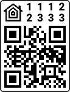
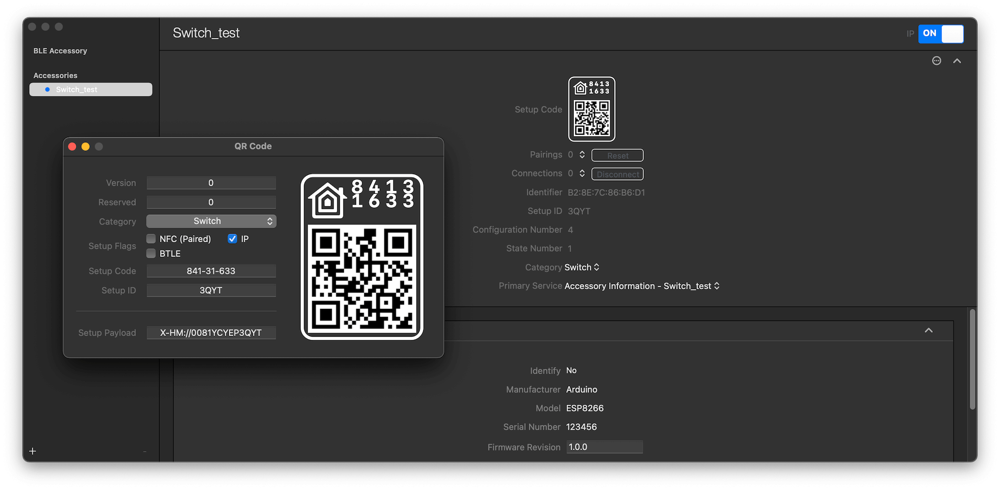

# HomeKit QR Code

Generate a pairing HomeKit QR code label for your HomeKit accessory

[](https://www.npmjs.com/package/homekit-qrcode)
[](https://github.com/simongolms/homekit-qrcode#readme)
[](https://github.com/simongolms/homekit-qrcode/graphs/commit-activity)
[](https://github.com/simongolms/homekit-qrcode/blob/master/LICENSE)
[](https://conventionalcommits.org)
[](https://github.com/SimonGolms/homekit-qrcode/releases)

## Usage

### CLI

```sh
Usage: homekit-qrcode [options]

Options:
  -h, --help                              [boolean]
      --version      Show version number  [boolean]
  -c, --category                          [string] [required] [choices: "other", "bridge", "fan", "garage", "lightbulb", "doorLock", "outlet", "switch", "thermostat", "sensor", "securitySystem", "door", "window", "windowCovering", "programmableSwitch", "rangeExtender", "ipCamera", "videoDoorBell", "airPurifier", "heater", "airConditioner", "humidifier", "dehumidifier", "appleTv", "speaker", "airport", "sprinkler", "faucet", "showerHead", "television", "targetController"]
  -o, --output                            [string] [default: "qrcode.svg"]
  -p, --pairingCode                       [string] [required]
  -s, --setupId                           [string] [required]

Examples:
  npx homekit-qrcode --category=switch --pairingCode=84131633 --setupId=3QYT Generate a QR code for a HomeKit switch
```

### Output



---

## Local Development

### Install Dependencies

```sh
npm install
```

### Start Development Server

```sh
npm run start -- --category=switch --pairingCode=11122333
```

### Build

To build `homekit-qrcode` for production, run:

```sh
npm run build
```

Afterwards the executable code is available under `./lib/`.

```sh
cd lib
node index.js --category=switch --pairingCode=11122333 --setupId=3QYT
```

### Run Tests

```sh
npm test
```

### Repair

This command may be useful when obscure errors or issues are encountered. It removes and recreates dependencies of your project.

```sh
npm run repair
```

### Release

Fully automated version management and package publishing via [semantic-release](https://github.com/semantic-release). It bumps the version according to conventional commits, publishes the package to npm and release a new version to GitHub.

#### Automatic Release (GitHub Action) [Recommended]

Make sure that the secrets `GITHUB_TOKEN` and `NPM_TOKEN` are available in GitHub repository.

```sh
npm run release:ci
```

#### Manual Release

Make sure that the environment variables `GITHUB_TOKEN` and `NPM_TOKEN` are set or declared in `.env` and a productive build was previously created via `npm run build`.

```sh
npm run release
```

You can also test the release manually by running the following command:

```sh
npm run release:dry-run
```

---

## FAQ

### Will my HomeKit accessory be able to pair with the generated QR code?

The QR code is not the same as the pairing code, instead it consists of several parameters such as the category, a specific version and other parameters.
This generated setup payload is the actual content of the QR code and can be generated with the [HomeKit Accessory Simulator (HAS)](https://developer.apple.com/documentation/homekit/testing_your_app_with_the_homekit_accessory_simulator) as well.



### How do I find out the setup id of my HomeKit Accessory?

Scan the QR code with a QR scanner of your choice. You should get a text starting with `X-HM://....` . The next 9 characters are the combination of the different parameters like the pairing code and the category. The remaining characters are the setup id.

```txt
X-HM://0081YCYEP3QYT ◄── Scanned Setup Payload

X-HM:// 008YCYEP 3QYT
  ▲        ▲      ▲
  │        │      └─── Setup ID
  │        └── Combination of Parameters (first 9 characters)
  └─ Starting Content
```

## Author

**Simon Golms**

- Digital Card: `npx simongolms`
- Github: [@SimonGolms](https://github.com/SimonGolms)
- Website: [gol.ms](https://gol.ms)

## Show your support

Give a ⭐️ if this project helped you!

## License

Copyright © 2021 [Simon Golms](https://github.com/simongolms).<br />
This project is [MIT](https://github.com/simongolms/homekit-qrcode/blob/master/LICENSE) licensed.

## Resources

- https://github.com/maximkulkin/esp-homekit
- https://developer.apple.com/documentation/homekit/hmaccessorycategory/accessory_category_types#overview
- https://developer.apple.com/documentation/homekit/testing_your_app_with_the_homekit_accessory_simulator
