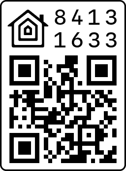

# HomeKit QR Code

<p>
    <a href="https://www.npmjs.com/package/homekit-qrcode" target="_blank">
    
  </a>
  <a href="https://github.com/simongolms/homekit-qrcode#readme" target="_blank">
    
  </a>
  <a href="https://github.com/simongolms/homekit-qrcode/graphs/commit-activity" target="_blank">
    
  </a>
  <a href="https://github.com/simongolms/homekit-qrcode/blob/master/LICENSE" target="_blank">
    
  </a>
    <a href="https://conventionalcommits.org" target="_blank">
    
  </a>
    <a href="#badge">
    
  </a>
</p>

> Generate a HomeKit pairing QR code for your HomeKit accessory

## Usage

```sh
npx homekit-qrcode --category=switch --pairingCode=111-22-333
HomeKit QR Code successfully generated
```



## Local Development

To start developing the `device-bars` web component using Stencil, clone this repo to a new directory:

```sh
git clone https://github.com/SimonGolms/homekit-qrcode.git homekit-qrcode
cd homekit-qrcode
git remote rm origin
```

```sh
npm install
npm start
```

### Build

To build `homekit-qrcode` for production, run:

```sh
npm run build
```

### Run Tests

```sh
npm test
```

### Repair

This command may be useful when obscure errors or issues are encountered. It removes and recreates dependencies of your project.

```sh
npm run repair
```

## Author

**Simon Golms**

- Digital Card: `npx simongolms`
- Github: [@SimonGolms](https://github.com/SimonGolms)
- Website: [gol.ms](https://gol.ms)

## Show your support

Give a ⭐️ if this project helped you!

## License

Copyright © 2020 [Simon Golms](https://github.com/simongolms).<br />
This project is [MIT](https://github.com/simongolms/homekit-qrcode/blob/master/LICENSE) licensed.

## Resources

- [esp-homekit](https://github.com/maximkulkin/esp-homekit)
